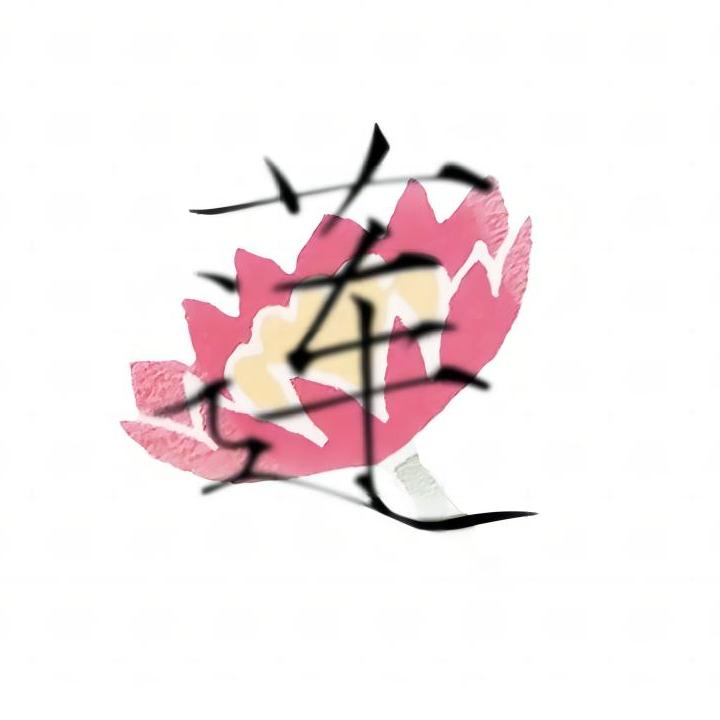

    
	&emsp;&emsp;&emsp;
    细莲の算法
    &emsp;&emsp;&emsp;
    

---

## 👨‍💻相关频道

- 🔗 
- 🔗 
- 🔗 
- 🔗 
- 

---

## 🧮总览

| Title        | Link                                                         |
| ------------ | ------------------------------------------------------------ |
| 个人算法笔记 | [算法笔记(停更中)](https://blog.csdn.net/CUBE_lotus/article/details/115142845) |
| 力扣题单     | [分类题集 (月频更新)](https://leetcode.cn/circle/discuss/vEFf96/) |
| 专题博客     | [算法竞赛](https://blog.csdn.net/cube_lotus/category_11273796.html) |

---

## ✍️题单系列

| Title       | Link                                                         |
| ----------- | ------------------------------------------------------------ |
| 背包dp      | [(背包dp) 力扣背包dp 题集记录](https://leetcode.cn/circle/discuss/xC899Q/) |
| 区间dp      | [(区间dp) 力扣区间dp 题集记录](https://leetcode.cn/circle/discuss/BO520a/) |
| 数位dp      | [(数位dp) 力扣数位dp 题集记录](https://leetcode.cn/circle/discuss/rlyap8/) |
| 状压dp      | [(状压dp) 力扣状压dp 题集记录](https://leetcode.cn/circle/discuss/bj3T6u/) |
| 树形dp      | [(树形dp) 力扣树形dp 题集记录](https://leetcode.cn/circle/discuss/saUFdd/) |
|             |                                                              |
| 线段树      | [(线段树) 力扣线段树 题集记录 ](https://leetcode.cn/circle/discuss/8FjzJT/) |
|             |                                                              |
| 线段树      | [(线段树) 基础线段树常见问题总结](https://blog.csdn.net/CUBE_lotus/article/details/126023573) |
| 数位dp      | [(数位dp) 算法竞赛入门到进阶 书本题集_算法竞赛入门到进阶罗勇军](https://blog.csdn.net/CUBE_lotus/article/details/127098613) |
| 背包9讲拓展 | [(背包dp) 背包N讲](https://blog.csdn.net/CUBE_lotus/article/details/123803635) |

---

## 💿专题系列

**动态规划专题**

| Title       | Link                                                         |
| ----------- | ------------------------------------------------------------ |
| 背包9讲拓展 | [(背包dp) 背包N讲](https://blog.csdn.net/CUBE_lotus/article/details/123803635) |
| 数位dp      | [(数位dp) 算法竞赛入门到进阶 书本题集_算法竞赛入门到进阶罗勇军](https://blog.csdn.net/CUBE_lotus/article/details/127098613) |
| 斐波那契    | [斐波那契的N种实现方式_斐波那契实现](https://blog.csdn.net/CUBE_lotus/article/details/124535448) |
|             |                                                              |
| 经典dp系列  | [I型 L型 铺盖2*n](https://blog.csdn.net/CUBE_lotus/article/details/127839691) |
| 经典dp系列  | [骨牌问题 2*n 3*n n*m_经典骨牌问题 dp](https://blog.csdn.net/CUBE_lotus/article/details/127895641) |
| 经典dp系列  | [(区间dp) 石子合并](https://blog.csdn.net/CUBE_lotus/article/details/126633896) |
| 经典dp系列  | [hdu 递推求解专题练习](https://blog.csdn.net/CUBE_lotus/article/details/127955857) |

**Other**

| Title  | Link                                                         |
| ------ | ------------------------------------------------------------ |
| 数论   | [(数论) 从判断素数到素数筛](https://blog.csdn.net/CUBE_lotus/article/details/122456109) |
| 数论   | [(数论) 除法取模(求逆元)](https://blog.csdn.net/CUBE_lotus/article/details/127592783) |
| 数论   | [(数论) 扩展gcd_gcd模版](https://blog.csdn.net/CUBE_lotus/article/details/127418139) |
|        |                                                              |
| 树     | [(树) 最近公共祖先（LCA）](https://blog.csdn.net/CUBE_lotus/article/details/126065519) |
| 树     | [(树) 树状数组](https://blog.csdn.net/CUBE_lotus/article/details/125430922) |
| 线段树 | [(线段树) 基础线段树常见问题总结](https://blog.csdn.net/CUBE_lotus/article/details/126023573) |
|        |                                                              |
| 图论   | [(图论) 最短路](https://blog.csdn.net/CUBE_lotus/article/details/122929706) |
| 图论   | [(图论) 连通分量(模板) + 强连通分量(模板)_无向图强连通分量 模板题](https://blog.csdn.net/CUBE_lotus/article/details/125475905) |
| 图论   | [(图论) Tarjan 算法_tarjan算法](https://blog.csdn.net/CUBE_lotus/article/details/125284917) |
|        |                                                              |
| 几何   | [(几何) 凸包问题](https://blog.csdn.net/CUBE_lotus/article/details/125418673) |
| 二分   | [(二分) 逼近类二分搜索_天赐细莲](https://blog.csdn.net/CUBE_lotus/article/details/123902484) |
| 排序   | [(排序) 各种排序算法汇总](https://blog.csdn.net/CUBE_lotus/article/details/123448097) |
| 哈希   | [(化简复杂度) 离散化](https://blog.csdn.net/CUBE_lotus/article/details/122330063) |
| 双指针 | [(双指针) 滑动窗口 定长与不定长](https://blog.csdn.net/CUBE_lotus/article/details/122803009) |

---

# END
